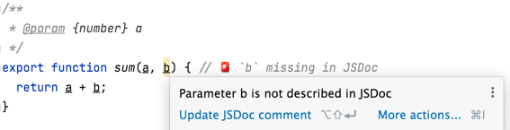

# ~~Tpyo~~ Typo

**Repo full of stupid mistakes**, to verify that _your editor is checking for them_.

❤️ Repo is work in progress, and still growing.

Do a fulltext search for `🚨` emoji, your editor should detect errors there.

❗ This repo is not meant to cover all the possible mistakes, just a few specific ones from different areas.

#### Covered mistakes

* Spelling
  * Incorrect spelling in comment
  * Incorrect spelling in variable name
  * Incorrect spelling in function name
* Markdown
  * Indentation for lists
  * References to non-existent files // TODO
* JavaScript
  * Call to non-existent method on object
  * Accessing non-existent members of object
    * e.g. `PropTypes.function` instead of `PropTypes.func`
  * JSDoc: Undocumented parameter
  * Missing await // TODO
  * ESLint
* (S)CSS
  * Code style
  * Stylelint
  * Non-existent imports
* Docker
  * // TODO
